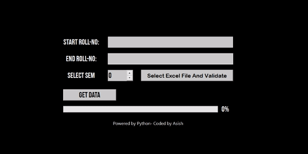

# Grade-Fetcher

## Tools I Used
- The whole care of processing from **backend** to **frontend** is take care by **[Python]**.
- **[Pyqt5]** offers a great frontend library for **Python**,and this is what i made my UI.
- Additionally i used **[Pyqt5]** designer tools for rapid development of UI.
- At backend **[Selenium]** web drivers runs and connect to my university website and fetch the required data.
- At same time the data gets saved to **excel-file** using **[Openpyxl]** library.

